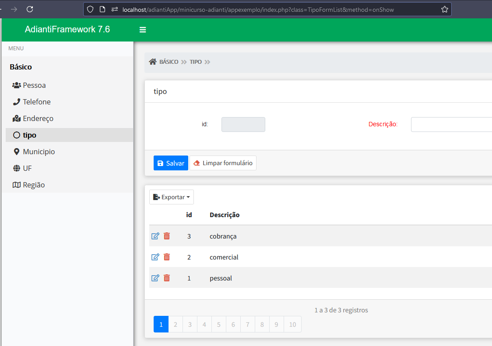

# Introdução

## Adianti Framework

> [!WARNING]
> Lembrando existe o Adianti Template e Adianti Framework, veja a diferença em [Apresentação > Ambiente](apresentacao.md#ambiente-adianti). Esse minicurso tem o foco no Adianti Framework


## Carregando o sistema

O que acontece quando chama seu sistema feito em Adianti ?

Se acesse a url do Adianti Tutor
https://framework.adianti.me/tutor/


Toda aplicação inicia no arquivo `<RAIZ_SISTEMA>/index.php` *somente na primeira vez em que o usuário acessa o sistema ou sempre que o mesmo forçar a recarga da página (F5 ou CTRL+R)*. Logo depois é chamado o arquivo `<RAIZ_SISTEMA>/init.php` que carrega todas as libs e informações do arquivo `<RAIZ_SISTEMA>/app/config/application.ini`. Logo depois é carregado o tema, injetando as várias informações como: MENU, LIBRARIES, {class} e etc.


No arquivo `<RAIZ_SISTEMA>/index.php` tem a linha abaixo o atributo class é o nome da classe que é um controlador.
```php
AdiantiCoreApplication::loadPage($_REQUEST['class'], $method, $_REQUEST);
```

## Estrutura de diretórios
Um ponto importante é conhecer a [estrutura de diretórios](estrutra_dir.md) do adianti para iniciar o entendimento especialmente [arquivos na raiz](estrutra_dir.md#detalhando-direito-na-raiz-e-arquivos) e [diretório APP](estrutra_dir.md#detalhando-direito-na-app)


## Apresentação, Tema e Layout

> [!WARNING]
> O Adianti framework utiliza o termo template para duas coisas diferentes:
* Template o esqueleto de sistema feito com Adianti, veja [Apresentação > Ambiente](apresentacao.md#ambiente-adianti)
* Template o esquema layout para o sistema.

> [!TIP]
> Para evitar confusão desse ponto para frente o termo template será sempre o esqueleto de sistema e termo TEMA será usado para aparência (esquema cores, layout, fonte e etc).

Se acesse a url do Adianti Tutor nos dois links e repare as diferenças
* https://framework.adianti.me/tutor/
* https://framework.adianti.me/tutor-material/index.php?class=HomeView

O Adianti tem dois temas básicos um com estilo BootStrap e outro com tema Material. O Tema é feito usando o [Twig](https://twig.symfony.com/) que é um motor de templates (template engine) para PHP. Ele permite separar a lógica da aplicação (PHP) da apresentação (HTML), promovendo uma arquitetura de código mais organizada e manutenível. Em conjunto com o [Admin LTE](https://adminlte.io/) para criar o Layout principal dos sistemas criados. O Layout pode ser no estilo bootstrap ou [Material](https://github.com/gurayyarar/AdminBSBMaterialDesign)

Os temas são responsivos: seja qual for o tamanho da tela vai acompanham a demanda, proporcionando uma experiência de uso facilitada. Os menus se adaptam automaticamente, permitindo uma navegação fluida em qualquer dispositivo. E não para por aí! Os formulários, datagrids e outros componentes também se ajustam perfeitamente ao espaço disponível.

Veja exemplos no Instragram do Adianti, exemplos da responsividade 
* [Veja exemplos gerais!](https://www.instagram.com/reel/Cu72aIZvb9F/)
* [Veja exemplo de formulários responsivos!](https://www.instagram.com/reel/CuFxt4aPlDk/)


No GitHub existe um projeto com vários temas. Veja https://github.com/bjverde/adianti-theme

<br>
<a href="https://www.youtube.com/watch?v=L8rqwF-VQqw">
    <br>Canal ScriptDevBR, no Youtube: Personalizando o Template do Adianti Framework
    <br>
</a>


## Um controlador de página
Uma página é representada por uma classe de controle, que poder conter diversos componentes do Framework: formulários, datagrids, campos, botões, links e etc.


As classes de controle podem ser filhas de TPage ou de TWindow.
* TPage são exibidas no quadro central do layout.
* TWindow são sempre exibidas em uma nova janela.
* outra opção é cortina lateral, geralmente com TPage

> [!IMPORTANT]
> Para sistema que serão usados também no celular ou exclusivamente no celular. Evite usar Janelas! Pois vai perder uma parte considerável da responsividade. Prefira cortina lateral. 

A classe a seguir é parte do código da de uma tela da aplicação de exemplo. Que mostrar a tela cadastro de tipo com filha de TPage

```php
class TipoFormList extends TPage
{
    private $form; // form
    private $datagrid; // listing
    private $pageNavigation;
    private $loaded;
    private static $database = 'maindatabase';
    private static $activeRecord = 'Tipo';
    private static $primaryKey = 'idtipo';
    private static $formName = 'form_TipoFormList';
    private $limit = 20;

    /**
     * Class constructor
     * Creates the page, the form and the listing
     */
    public function __construct($param)
    {
        parent::__construct();
        // creates the form
        $this->form = new BootstrapFormBuilder(self::$formName);

        // define the form title
        $this->form->setFormTitle("tipo");
        $this->limit = 20;
```

Imagem da tela código acima
<br>


<br>
<a href="https://www.youtube.com/watch?v=ly4C2oqpzK8">
    <br>Canal ScriptDevBR, no Youtube: Classe Controlle no Adianti Framework
    <br>
</a>


## Menu 

O Arquivo do menu fica em `<RAIZ_SISTEMA>/menu.xml` o menu é composto basicamente dos itens
* menuitem com o atributo label="Nome que vai aparecer"
* icon geralmente do font awesome, olhe o [Tutor no componente Ticon](https://framework.adianti.me//tutor/index.php?class=FormComponentsView) seguido da cor do icone
* action é nome da classe podendo ter o nome do metodo ou não

```xml
<?xml version="1.0" encoding="utf-8"?>
<menu>
  <menuitem label="Básico">
    <icon> fa-fw </icon>
    <menu>
      <menuitem label="Pessoa">
        <icon>fas:users fa-fw </icon>
        <action>PessoaList#method=onShow</action>
      </menuitem>
      <menuitem label="Telefone">
        <icon>fas:phone fa-fw </icon>
        <action>TelefoneList#method=onShow</action>
      </menuitem>
  </menuitem>
</menu>      
```


# Navegação
* [Súmario](../README.md)
    * [Apresentação e Visão geral](apresentacao.md)
    * [Conhecimentos requeridos](conhecimento_requerido.md)
    * [Introdução](introducao.md)
        * [Estrutura de diretórios](estrutra_dir.md)
    * [Instalação](instalacao.md)
    * [Banco de dados](banco_model.md)
    * [Componentes](componentes.md)
    * [Criando Sistema](criando_sistema.md)
    * [Vídeos complementares sobre Adianti no YouTube](videos_youtube.md)